# geo-api architecture

## Executive summary

geo-api accepts KML files and ZIP archives that contain one Shapefile dataset. FastAPI handles the request and PostgreSQL is the source of truth for file summaries and feature results. A separate worker process parses and measures the upload, then returns a bounded manifest and JSON Lines file to the API process.

The API publishes a completed dataset only after it validates the worker's entire output. It inserts the file summary and feature records in one PostgreSQL transaction. The worker never receives database credentials.

### System architecture

The diagram shows the synchronous upload path, the worker boundary, the database write, and the read path. The SVG in the [README](README.md#architecture) is a hand-drawn companion view of this flow.

```mermaid
flowchart LR
    accTitle: geo-api request and processing flow
    accDescr: An HTTP client sends an upload through request admission and FastAPI. The API stages it in a private workspace, runs an isolated worker, validates the worker output, writes terminal records to PostgreSQL, and serves later reads from the database.

    client["HTTP client"]
    admission["RequestBoundaryMiddleware<br/>request ID, upload slot,<br/>body and time limits"]
    upload["Upload route<br/>multipart validation,<br/>staging, checksum"]
    workspace["Private request workspace<br/>source upload and worker output"]

    subgraph api["FastAPI parent process"]
        admission
        upload
        runner["Worker runner<br/>start, timeout, reap"]
        validate["Validate manifest and JSONL<br/>bounds, order, counts, statuses"]
        publish["One publication transaction<br/>file summary and features"]
        read["Read and delete routes"]
    end

    subgraph worker["Worker subprocess"]
        reader["KML and Shapefile readers"]
        measurement["CRS transform and measurement"]
        output["Terminal manifest and<br/>ordered feature JSONL"]
        reader --> measurement --> output
    end

    database[("PostgreSQL<br/>files and features")]
    response["HTTP response"]

    client --> admission --> upload --> workspace
    upload --> runner --> reader
    output --> validate
    validate -->|completed| publish --> database --> response
    validate -->|processor failure| failed["Save FAILED summary<br/>when PostgreSQL is available"]
    failed --> response
    database --> read --> response
    response --> client
    workspace -. "remove in route cleanup" .-> cleanup["Temporary files deleted"]
    cleanup --> response

    classDef apiPart fill:#e8f0ff,stroke:#52678e,color:#1e293b,stroke-width:1.5px
    classDef workerPart fill:#fff2cf,stroke:#9a7731,color:#332b1b,stroke-width:1.5px
    classDef dataPart fill:#e6f3e8,stroke:#4e7858,color:#1d3322,stroke-width:1.5px
    class admission,upload,runner,validate,publish,read apiPart
    class reader,measurement,output workerPart
    class workspace,database,failed,cleanup dataPart
```



### Dependency hierarchy

The HTTP request enters the middleware before FastAPI parses the upload. The upload route owns staging and calls the runner. The runner starts the worker, which depends on the readers and measurement code. The worker returns files through the private workspace; it does not call the database. The route validates the worker result and uses the database session and models to publish it. Read and delete routes use the same database models.

```text
HTTP client -> RequestBoundaryMiddleware -> FastAPI routes -> worker runner
worker runner -> worker -> readers -> measurement
FastAPI routes -> database session and models -> PostgreSQL
worker -> bounded manifest and feature JSONL -> runner validation -> routes
```

The boundary to preserve is between processing and publication. Treat worker output as untrusted input. Do not open the publication transaction until the parent has checked the complete manifest and feature stream.

## Request lifecycle

### Upload request

1. `RequestBoundaryMiddleware` assigns a request ID and admits one upload at a time. It counts the streamed multipart body and applies receive and overall request deadlines before the route parses the form.
2. `upload_file` requires exactly one `file` field, checks the filename and suffix, and copies the upload into a private workspace while enforcing the uploaded-byte limit and computing SHA-256.
3. The route checks PostgreSQL readiness. If PostgreSQL is unavailable before processing starts, it returns `503` without a file row.
4. `run_processor` starts `geo_api.processing.worker` without a shell. The child receives the input path, workspace, format, and bounded settings. It does not receive the database URL.
5. The worker calls `process_input`. The reader handles KML Placemark records or checks and extracts the required Shapefile components. It preserves source geometry, properties, metadata, and CRS information.
6. The measurement code transforms supported feature coordinates to WGS84. It measures lines in local ellipsoidal AEQD and polygons in local ellipsoidal LAEA, subject to the extent and work budgets. Points receive `NOT_APPLICABLE`; unsupported types and invalid features receive explicit outcomes.
7. The worker writes bounded feature JSON Lines and a terminal manifest. The runner checks the schema, output size, feature index order, counts, statuses, and protocol version.
8. The route saves a completed result in one transaction. If the processor reports a file-level failure, the API attempts to save a `FAILED` summary without feature rows. A database publication error returns `503` and may leave no row.
9. The route removes the request workspace and closes the multipart form in cleanup. The middleware releases the upload slot. On startup, `main.py` removes abandoned app-owned request directories.

The request stays open until processing and publication finish. V1 does not create an in-progress database record or submit work to a durable queue.

### Read and delete requests

The read routes query PostgreSQL for file summaries, measurement pages, feature summaries, or one feature detail. File listing uses an opaque cursor. Measurement and feature pages use offsets. `DELETE /api/files/{file_id}/` deletes the file row; the foreign key cascades the deletion to feature rows.

## Components and ownership

| Component | Owns | Does not own |
|---|---|---|
| `RequestBoundaryMiddleware` | Request ID, response headers, upload admission, streamed-body limit, request deadlines, disconnect handling, and cancellation boundaries. | Multipart field and filename validation, processing, or database publication. |
| `api/routes.py` | Multipart parsing, file checks, private workspace setup, processor invocation, worker-output validation coordination, database publication, API serialization, and cleanup. | Parsing geospatial formats or calculating measurements. |
| `processing/runner.py` | Child process creation and reaping, timeout and crash handling, output size checks, protocol validation, and feature iteration. | Database access or HTTP response formatting. |
| `processing/worker.py` | Worker resource limits, reader invocation, and atomic writes of feature JSONL and the terminal manifest. | Database access, request admission, or publication. |
| `processing/readers.py` | KML and Shapefile parsing, source feature extraction, CRS handling, and per-feature measurement calls. | Persistent storage or API response serialization. |
| `processing/measurement.py` | CRS validation and transformation, local projection selection, geometry and topology checks, densification, and area or length calculation. | Parsing files or selecting API request policy. |
| `db/models.py` and `db/session.py` | PostgreSQL schema mapping, connection management, constraints, transactions, and query sessions. | Worker execution or source-file retention. |
| `processing/storage.py` | Secure creation, validation, and removal of app-owned request workspaces. | Retaining uploaded source files after the request. |

## Data and failure behavior

The `files` table stores one terminal file summary, counters, source CRS information, warnings, and failure metadata. The `features` table stores ordered feature results, source geometry and properties, measurement status and values, issues, and provenance. The feature key is `(file_id, feature_index)`, and its foreign key cascades on file deletion.

Admission, multipart validation, suffix validation, upload copying, and the initial database-readiness check can fail before processing. These failures do not create a file row. A processor-reported file-level error can create one `FAILED` summary if PostgreSQL is available. Per-feature errors can remain within a `COMPLETED` file. Database publication failure returns `503`; the outcome can be ambiguous if the connection is lost during commit.

Limits are configured in `geo_api.config.Settings` and in the measurement module. The documented defaults include a 10 MiB upload, a 50 MiB expanded archive, 5,000 features, 100,000 source coordinates per file, a 60-second worker deadline, and a 64 MiB child-output limit. Linux workers also use `RLIMIT_*` limits. See [Design and failure behavior](docs/design.md) for the complete limits and error mapping.

## Source map

| Concern | Source |
|---|---|
| Application lifespan and route setup | [`src/geo_api/main.py`](src/geo_api/main.py) |
| Upload admission and request boundaries | [`src/geo_api/middleware/admission.py`](src/geo_api/middleware/admission.py) |
| Upload, publication, read, and delete endpoints | [`src/geo_api/api/routes.py`](src/geo_api/api/routes.py) |
| Child lifecycle and output validation | [`src/geo_api/processing/runner.py`](src/geo_api/processing/runner.py) |
| Child execution and output files | [`src/geo_api/processing/worker.py`](src/geo_api/processing/worker.py) |
| KML and Shapefile parsing | [`src/geo_api/processing/readers.py`](src/geo_api/processing/readers.py) |
| CRS transformations and measurements | [`src/geo_api/processing/measurement.py`](src/geo_api/processing/measurement.py) |
| Workspace ownership and cleanup | [`src/geo_api/processing/storage.py`](src/geo_api/processing/storage.py) |
| Stored file and feature constraints | [`src/geo_api/db/models.py`](src/geo_api/db/models.py) |
| Runtime limits | [`src/geo_api/config.py`](src/geo_api/config.py) |

## Verification

The implementation claims above are supported by `tests/test_admission.py`, `tests/test_runner.py`, `tests/test_readers.py`, `tests/test_measurement.py`, `tests/test_storage.py`, `tests/test_publication.py`, and `tests/test_api_postgres.py`. The PostgreSQL API tests require `TEST_DATABASE_URL`; without it, pytest skips those integration cases. See the [testing guide](docs/testing.md) for the commands, fixture details, and coverage limits.

The test suite checks selected CRS operations, geometries, numerical references, and failure paths. It does not prove that every CRS transformation or every geometry near the 100 km boundary is supported. The service returns an explicit failure when it cannot verify a result under its configured policy.
